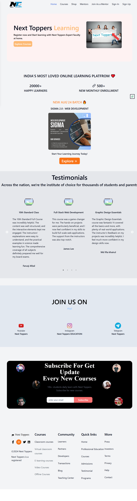
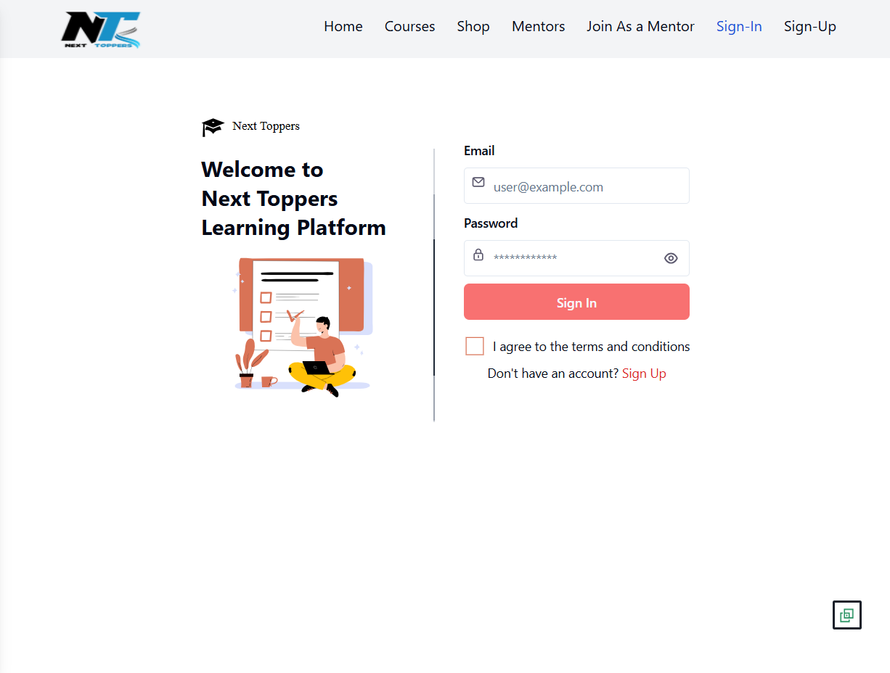
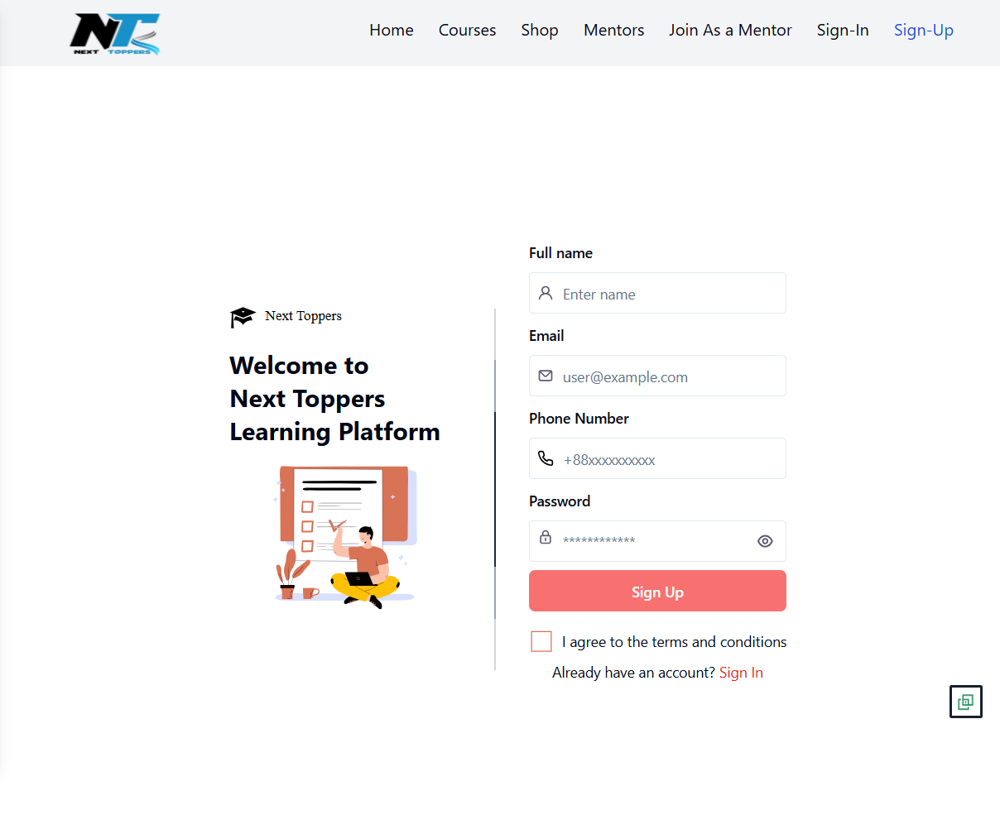
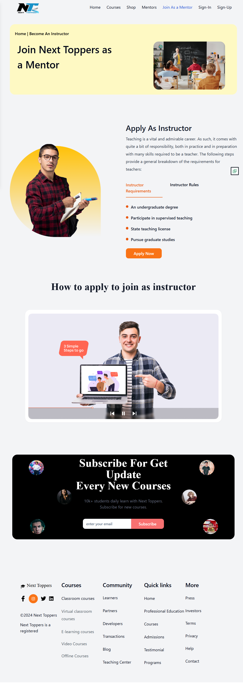

# Next-Toppers

A full-stack Learning Management System (LMS) built using the MERN stack. The platform enables students to access learning resources while providing administrators with tools to manage educational content through a modern web interface.

---

## Features

- User Authentication
- Student Dashboard
- Admin Dashboard
- Course Management
- Responsive User Interface
- RESTful APIs
- Secure Environment Configuration

---

## Tech Stack

### Frontend
- React.js
- Vite
- Tailwind CSS
- JavaScript

### Backend
- Node.js
- Express.js
- MongoDB
- REST API

---

## Project Structure

```
Next-Toppers
│
├── Frontend/
│   ├── src/
│   ├── public/
│   └── package.json
│
├── Backend/
│   ├── src/
│   ├── public/
│   └── package.json
│
└── README.md
```

---

## Installation

### Clone Repository

```bash
git clone https://github.com/MohdKashif142/Next-Toppers.git
```

### Frontend

```bash
cd Frontend
npm install
npm run dev
```

### Backend

```bash
cd Backend
npm install
npm run dev
```

---

## Screenshots

### Home Page


### Sign In


### Sign Up


### Become a Mentor


## Environment Variables

Create `.env` files inside both Frontend and Backend directories using the provided `.env.sample` files.

---

## Future Improvements

- Online quizzes
- Assignment submission
- Attendance management
- Video lecture integration
- Notifications
- Performance analytics

---

## License

MIT
